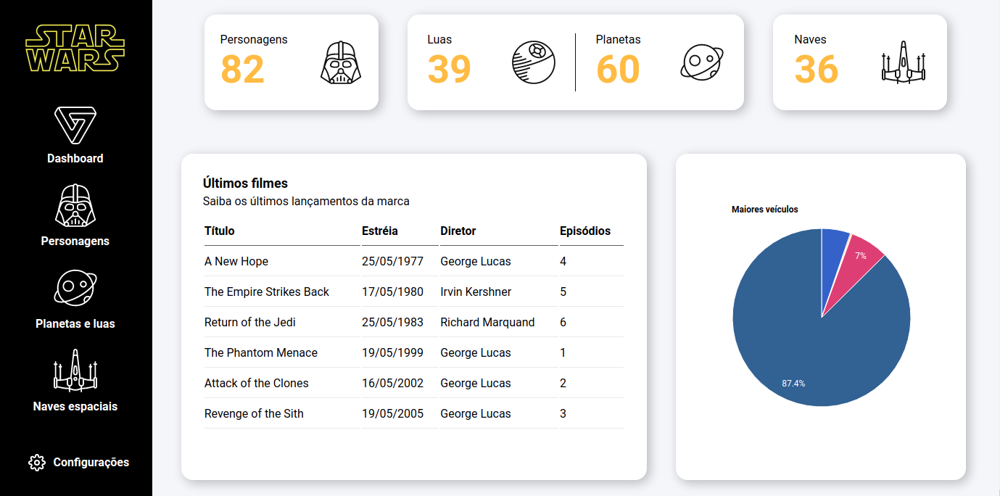

# Dashboard Star Wars

  

## 🚀 Tecnologias

Esse projeto foi desenvolvido com as seguintes tecnologias:

- HTML
- CSS
- JavaScript

Outras tecnologias:

- The Star Wars API (SWAPI)
- Axios
- jQuery CDN
- Moment.js
- Google charts

## 💻 Projeto      

Este projeto é uma Dashboard Star Wars que tem como base a API SWAPI.

Você pode visualizar o projeto através [desse link](https://romantic-snyder-1b0406.netlify.app/).

---
Projeto realizado com ajuda da Isadora do canal [Papo de Dev](https://www.youtube.com/channel/UCRhKK6VrISnIWPJjYxBPKnA).

